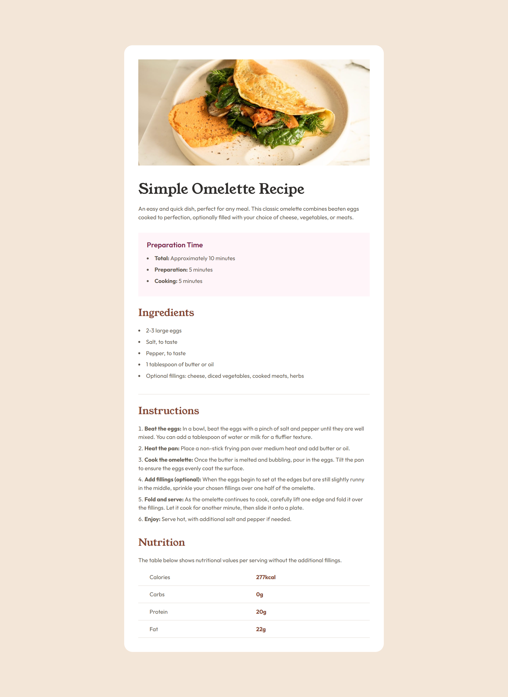

# Frontend Mentor - Recipe page solution

This is a solution to the [Recipe page challenge on Frontend Mentor](https://www.frontendmentor.io/challenges/recipe-page-KiTsR8QQKm). Frontend Mentor challenges help you improve your coding skills by building realistic projects. 

## Table of contents

- [Overview](#overview)
  - [Screenshot](#screenshot)
  - [Links](#links)
- [My process](#my-process)
  - [Built with](#built-with)
  - [Approach](#approach)
  - [Variable Font Sizing](#variable-font-sizing)
  - [What I learned](#what-i-learned)
- [Author](#author)

## Overview

### Screenshot



### Links

- Solution URL: [https://github.com/christattum/fem-blog-preview-card](https://github.com/christattum/fem-recipe-page)
- Live Site URL: [https://christattum.github.io/fem-blog-preview-card](https://christattum.github.io/fem-recipe-page)

## My process

### Built with

- Semantic HTML5 markup
- CSS custom properties
- CSS clamp()
- Flexbox
- Tables

### Approach

Used CSS variables to control the theme, so it's easy to change. There's a bit more setup, but it saves time long term.

Added general styles for any table, but added the bold second column only to a nutrition table.

Also uses variable font size for the h1 heading to scale from mobile size to desktop size.

### Variable Font Sizing

The CSS clamp() function is used for the h1 variable font size.

By using the 62.5% root font size trick, I could use rems instead of pixels, where 1 rem = 10px so the maths is easy :) In the CSS Clamp Calculator utility linked below, I set 1rem = 10px to reflect this.

Set the min/max viewport sizes to 375px/1440px as per the style guide. Then set the min/max font sizes to 3.6/4rem to calculate the clamp function values used for the CSS variable.

### What I learned

Used ```list-style-position: inside``` to align the list item bullets with the heading, instead of outside it.

Almost missed that the mobile layout has no rounded card and header image padding, so need to pay more attention in future! Had to add the padding to the header and card content separately rather than to the entire card, then add a media query to remove it for the header, along with the card border-radius. This is in one of the final commits.

### Useful resources

- [CSS Clamp Calculator](https://clamp-calculator.netlify.app) - This calculated the CSS clamp function with the correct values as outlined above.

## Author

- Website - [Chris Tattum](https://christattum.com)
- Frontend Mentor - [@christattum](https://www.frontendmentor.io/profile/christattum)
- X - [@christattum](https://www.x.com/christattum)
- Bluesky - [@christattum](https://bsky.app/profile/christattum.bsky.social)

